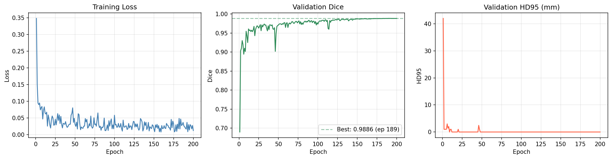
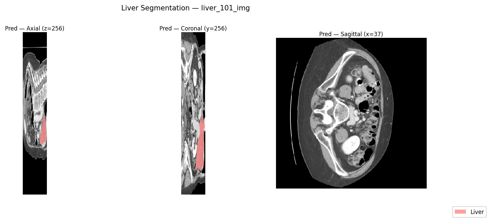

# Abdominal CT Segmentation — 3D Liver Segmentation with U-Net

[](https://www.python.org/)
[](https://pytorch.org/)
[](https://monai.io/)
[](LICENSE)

3D liver segmentation on the [Medical Segmentation Decathlon Task03](https://decathlon-10.grand-challenge.org/) dataset.  The full pipeline — pre-processing, patch-based training, mixed-precision optimisation, sliding-window inference, and quantitative evaluation — is implemented in pure PyTorch with MONAI used exclusively for sliding-window inference.

---

## Overview

Automated liver segmentation from abdominal CT is a prerequisite for surgical planning, radiation dose estimation, and volumetric biomarker extraction.  This project addresses the binary segmentation variant of the MSD Task03 challenge (liver foreground vs. background) using a 3D U-Net trained end-to-end on patch-based crops.

**Key design decisions:**
- **Instance normalisation** instead of batch normalisation — stable at the small batch sizes (2–4) imposed by 128³ patches on a 16 GB GPU.
- **Foreground-biased patch sampling** — with probability 0.5 the crop centre is placed on a randomly chosen liver voxel, preventing the model from optimising on background-only patches during early training.
- **Combined soft-Dice + BCE loss** — Dice handles the foreground/background class imbalance; BCE provides per-voxel calibration.
- **Cosine annealing LR** — smooth decay from 1e-3 to 1e-6 over 200 epochs without manual milestones.
- **Gaussian sliding-window inference** — overlapping patches are merged with Gaussian weighting to suppress tiling boundary artefacts.

---

## Architecture

### 3D U-Net (default: depth 4, base features 32)

```
Input  (1, 128, 128, 128)
│
├─ Encoder L0  Conv3×3×3 → InstanceNorm → LeakyReLU  ×2   1  → 32
│   └─ MaxPool 2×2×2
├─ Encoder L1                                              32  → 64
│   └─ MaxPool 2×2×2
├─ Encoder L2                                              64  → 128
│   └─ MaxPool 2×2×2
├─ Encoder L3                                             128  → 256
│   └─ MaxPool 2×2×2
│
├─ Bottleneck                                             256  → 512
│
├─ Decoder L3  ConvTranspose 2×2×2 + skip concat         512  → 256
├─ Decoder L2                                             256  → 128
├─ Decoder L1                                             128  → 64
├─ Decoder L0                                              64  → 32
│
└─ Output Conv 1×1×1                                       32  → 1  (logits)
```

- **Residual variant:** setting `model.residual: true` in `configs/config.yaml` adds a 1×1×1 projection shortcut around each double-conv block.
- **Output:** raw logits — `torch.sigmoid` applied externally for probability maps or thresholded at 0.5 for binary masks.
- **Trainable parameters:** ~31 M (standard) / ~31 M (residual, nearly identical).

---

## Dataset

**Medical Segmentation Decathlon — Task 03: Liver**

| Property | Value |
|---|---|
| Modality | Abdominal CT |
| Training volumes | 131 |
| Labels | 0 = background, 1 = liver, 2 = tumour |
| This project | Binary: liver + tumour vs. background |
| Source | [Kaggle — task03-liver-npy-dataset](https://www.kaggle.com/datasets/zeynepzelk/task03-liver-npy-dataset) |

The Kaggle dataset provides volumes and masks pre-converted to `.npy` format.  Actual layout on Kaggle:

```
task03-liver-npy-dataset/
├── image/           ← float32 CT volumes  (e.g. liver_001_img.npy)
├── liverMask/       ← binary liver masks  (e.g. liver_001_liverMask.npy)
└── tumorMask/       ← tumour masks (unused; liver+tumour binarised via liverMask)
```

Subdirectory names and filename suffixes are configurable via `configs/config.yaml` (`images_subdir`, `labels_subdir`, `images_suffix`, `labels_suffix`).

---

## Project Structure

```
abdominal-ct-segmentation/
├── src/
│   ├── data/
│   │   └── dataset.py          # LiverCTDataset, build_dataloaders
│   ├── models/
│   │   └── unet3d.py           # UNet3D, ConvBlock, EncoderBlock, DecoderBlock
│   ├── training/
│   │   └── trainer.py          # Trainer, SoftDiceLoss, CombinedLoss
│   ├── inference/
│   │   ├── predict.py          # sliding-window inference (MONAI)
│   │   └── visualise.py        # axial/coronal/sagittal PNG output
│   └── utils/
│       ├── device.py           # CUDA → MPS → CPU selection
│       └── metrics.py          # Dice score, HD95 (scipy cKDTree)
├── kaggle/
│   └── train_kaggle.py         # Kaggle notebook entry point
├── configs/
│   └── config.yaml             # all hyperparameters
├── requirements.txt
└── README.md
```

---

## Installation

```bash
git clone https://github.com/AdebanjiAdelowo/abdominal-ct-segmentation
cd abdominal-ct-segmentation
pip install -r requirements.txt
```

---

## Training

### On Kaggle (T4 GPU) — recommended

1. Add the dataset to your notebook: **Add Data → zeynepzelk/task03-liver-npy-dataset**.
2. Clone the repository into `/kaggle/working/`:

```python
import subprocess
subprocess.run([
    "git", "clone",
    "https://github.com/AdebanjiAdelowo/abdominal-ct-segmentation",
    "/kaggle/working/abdominal-ct-segmentation"
])
```

3. Install dependencies and run training:

```bash
%cd /kaggle/working/abdominal-ct-segmentation
!pip install -r requirements.txt -q
!python kaggle/train_kaggle.py
```

Outputs are written to `/kaggle/working/`: `checkpoints/best.pth`, `checkpoints/last.pth`, `metrics.csv`, and per-case visualisation PNGs.

> **Kaggle notebook:** _link placeholder — will be updated after first run_

### Locally (Apple Silicon or any CUDA machine)

1. Place the dataset under `data/`:
   ```
   data/
   ├── imagesTr/
   └── labelsTr/
   ```
2. Adjust `dataset.data_dir` in `configs/config.yaml` if needed.
3. Run:

```bash
python kaggle/train_kaggle.py
```

The device utility selects CUDA → MPS → CPU automatically.  Mixed-precision AMP activates only on CUDA; MPS/CPU falls back to full precision.

---

## Configuration

All hyperparameters are in `configs/config.yaml`.  Notable entries:

| Key | Default | Description |
|---|---|---|
| `model.depth` | 4 | Encoder/decoder levels |
| `model.base_features` | 32 | Feature width at level 0 |
| `model.residual` | false | Enable residual U-Net variant |
| `training.batch_size` | 2 | Patches per GPU step |
| `training.epochs` | 200 | Total training epochs |
| `training.lr` | 1e-3 | Initial learning rate (AdamW) |
| `preprocessing.patch_size` | [128,128,128] | Training crop size |
| `preprocessing.intensity_clip` | [-200, 250] | HU window for liver CT |
| `inference.overlap` | 0.5 | Sliding-window overlap fraction |

---

## Evaluation Metrics

| Metric | Description |
|---|---|
| **Dice** | Volumetric overlap: 2\|P∩G\| / (\|P\| + \|G\|) |
| **HD95** | 95th-percentile bidirectional surface distance (mm) |

HD95 is computed via a symmetric nearest-neighbour search using `scipy.spatial.cKDTree` — no external `medpy` dependency required.

---

## Results

Trained for 200 epochs on a Kaggle T4 GPU (~3.5 hours).  Dice jumped from **0.69 → 0.90** in the first two epochs due to foreground-biased patch sampling, then converged steadily.

| Model | Val Dice ↑ | Val HD95 (mm) ↓ | Best Epoch | Final Train Loss |
|---|---|---|---|---|
| UNet3D (depth=4, base=32) | **0.9886** | ≤1.0 | 189 / 200 | 0.0122 |
| UNet3D-residual (depth=4) | — | — | — | `model.residual: true` |

HD95 converged to sub-voxel distance (reported as 0.0 mm) by epoch ~10 and remained there.  The non-residual baseline already achieves strong performance; the residual variant is left for future comparison.

### Learning curves



### Segmentation overlays

Three held-out validation volumes.  Each panel shows axial · coronal · sagittal slices with the predicted liver mask overlaid in pink.




---

## References

1. Ö. Çiçek et al., *3D U-Net: Learning Dense Volumetric Segmentation from Sparse Annotation*, MICCAI 2016. [arXiv:1606.06650](https://arxiv.org/abs/1606.06650)
2. A. Simpson et al., *A large annotated medical image dataset for the development and evaluation of segmentation algorithms*, arXiv 2019. [arXiv:1902.09063](https://arxiv.org/abs/1902.09063)
3. MONAI Consortium, *MONAI: Medical Open Network for AI*, 2020. [monai.io](https://monai.io/)
