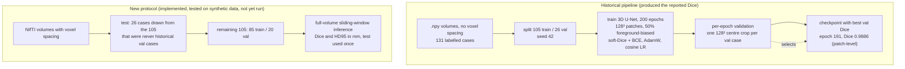

# Abdominal CT Segmentation: 3D Liver Segmentation with U-Net

[](https://www.python.org/)
[](https://pytorch.org/)
[](https://monai.io/)
[](LICENSE)

3D liver segmentation on the [Medical Segmentation Decathlon Task03](https://decathlon-10.grand-challenge.org/) dataset.  The full pipeline (pre-processing, patch-based training, mixed-precision optimisation, sliding-window inference, and quantitative evaluation) is implemented in pure PyTorch with MONAI used exclusively for sliding-window inference.

---

## Overview

Automated liver segmentation from abdominal CT is a prerequisite for surgical planning, radiation dose estimation, and volumetric biomarker extraction.  This project is a research/learning implementation that addresses the binary segmentation variant of the MSD Task03 challenge (liver foreground vs. background) using a 3D U-Net trained end-to-end on patch-based crops. It has been evaluated only on this single dataset and task; it has not been clinically validated, is not intended for diagnostic or clinical use, and no claim is made about generalisation beyond MSD Task03 liver CT.

**Key design decisions:**
- **Instance normalisation** instead of batch normalisation: stable at the small batch sizes (2–4) imposed by 128³ patches on a 16 GB GPU.
- **Foreground-biased patch sampling**: with probability 0.5 the crop centre is placed on a randomly chosen liver voxel, preventing the model from optimising on background-only patches during early training.
- **Combined soft-Dice + BCE loss**: Dice handles the foreground/background class imbalance; BCE provides per-voxel calibration.
- **Cosine annealing LR**: smooth decay from 1e-3 to 1e-6 over 200 epochs without manual milestones.
- **Gaussian sliding-window inference**: overlapping patches are merged with Gaussian weighting to suppress tiling boundary artefacts.

---

## Architecture

### 3D U-Net (default: depth 4, base features 32)

```
Input  (1, 128, 128, 128)
│
├─ Encoder L0  Conv3×3×3 → InstanceNorm → LeakyReLU  ×2   1  → 32
│   └─ MaxPool 2×2×2
├─ Encoder L1                                              32  → 64
│   └─ MaxPool 2×2×2
├─ Encoder L2                                              64  → 128
│   └─ MaxPool 2×2×2
├─ Encoder L3                                             128  → 256
│   └─ MaxPool 2×2×2
│
├─ Bottleneck                                             256  → 512
│
├─ Decoder L3  ConvTranspose 2×2×2 + skip concat         512  → 256
├─ Decoder L2                                             256  → 128
├─ Decoder L1                                             128  → 64
├─ Decoder L0                                              64  → 32
│
└─ Output Conv 1×1×1                                       32  → 1  (logits)
```

- **Residual variant:** setting `model.residual: true` in `configs/config.yaml` adds a 1×1×1 projection shortcut around each double-conv block.
- **Output:** raw logits: `torch.sigmoid` applied externally for probability maps or thresholded at 0.5 for binary masks.
- **Trainable parameters:** ~22.6 M (standard) / ~22.9 M (residual), measured directly from `UNet3D` at `depth=4, base_features=32`.

---

## Dataset

**Medical Segmentation Decathlon, Task 03: Liver**

| Property | Value |
|---|---|
| Modality | Abdominal CT |
| Training volumes | 131 |
| Labels | 0 = background, 1 = liver, 2 = tumour |
| This project | Binary: liver + tumour vs. background |
| Source | [Kaggle: task03-liver-npy-dataset](https://www.kaggle.com/datasets/zeynepzelk/task03-liver-npy-dataset) |

The Kaggle dataset provides volumes and masks pre-converted to `.npy` format.  Actual layout on Kaggle:

```
task03-liver-npy-dataset/
├── image/           ← float32 CT volumes  (e.g. liver_001_img.npy)
├── liverMask/       ← binary liver masks  (e.g. liver_001_liverMask.npy)
└── tumorMask/       ← tumour masks (unused; liver+tumour binarised via liverMask)
```

Subdirectory names and filename suffixes are configurable via `configs/config.yaml` (`images_subdir`, `labels_subdir`, `images_suffix`, `labels_suffix`).

Volumes are split 80/20 into train/validation with a fixed seed (`np.random.default_rng(42)` in `build_dataloaders`), giving 105 training and 26 validation volumes out of the 131 labelled MSD Task03 volumes. There is no separate held-out test set: MSD's own Task03 test split (70 volumes) ships without public labels, so all quantitative results below come from the internal validation split, not an independent test set.

---

## Project Structure

```
abdominal-ct-segmentation/
├── src/
│   ├── data/
│   │   ├── dataset.py          # LiverCTDataset, NiftiLiverDataset, split_case_names, build_dataloaders
│   │   ├── nifti.py            # NIfTI loading with voxel spacing / orientation handling
│   │   ├── splits.py           # frozen 3-way split, SHA-256 fingerprint
│   │   └── validate_dataset.py # structure and duplicate-content checks
│   ├── models/
│   │   └── unet3d.py           # UNet3D, ConvBlock, EncoderBlock, DecoderBlock
│   ├── training/
│   │   ├── trainer.py          # Trainer (atomic checkpoints, resume), SoftDiceLoss, CombinedLoss
│   │   └── protocol_train.py   # training under the new protocol
│   ├── inference/
│   │   ├── predict.py          # sliding-window inference (MONAI)
│   │   ├── evaluate.py         # historical .npy format: full-volume Dice + HD95 in voxels only
│   │   ├── evaluate_protocol.py# new protocol: NIfTI, full-volume Dice + HD95 in mm, test-set guards
│   │   └── visualise.py        # orthogonal mid-slice overlay PNGs (neutral axis labels)
│   ├── utils/
│   │   ├── device.py           # CUDA → MPS → CPU selection
│   │   ├── metrics.py          # Dice score, surface-based HD95 (scipy erosion + cKDTree)
│   │   └── provenance.py       # atomic writes, verified mirror copies, git state, checkpoint checks
│   └── smoke_test.py           # end-to-end infrastructure smoke test (never a result)
├── kaggle/
│   └── train_kaggle.py         # historical Kaggle entry point (.npy pipeline)
├── colab/
│   └── run_protocol.ipynb      # thin launcher: calls the CLIs above on a Colab GPU
├── configs/
│   └── config.yaml             # all hyperparameters
├── docs/
│   ├── EVALUATION_PROTOCOL.md  # split, leakage rules, mm-HD95, aggregation, reporting rules
│   └── images/                 # learning curve used by this README; historical overlay PNGs kept for audit provenance only
├── notebooks/
│   └── results.ipynb           # reads metrics.csv, renders the learning curves
├── tests/
│   ├── test_hd95.py            # HD95 regression tests (synthetic, known-answer geometry)
│   ├── test_evaluate.py        # historical full-volume evaluator (synthetic data)
│   ├── test_protocol.py        # split, NIfTI geometry, mm-HD95, leakage guards (synthetic data)
│   ├── test_infrastructure.py  # checkpoints, resume, validator, duplicate-content checks, smoke test (synthetic data)
│   └── test_visualise.py       # neutral overlay labels (synthetic data)
├── requirements.txt
└── README.md
```

`checkpoints/`, `outputs/`, `data/`, and `results/` (historically holding the trained `best.pth`, which has since been lost, plus `metrics.csv` and visualisation PNGs) are excluded from version control via `.gitignore`; checkpoints and the dataset must never be committed; the figures under `docs/images/` are the tracked copies used to render this README.

---

## Installation

```bash
git clone https://github.com/AdebanjiAdelowo/abdominal-ct-segmentation
cd abdominal-ct-segmentation
pip install -r requirements.txt
```

---

## Training

### On Kaggle (T4 GPU), recommended

1. Add the dataset to your notebook: **Add Data → zeynepzelk/task03-liver-npy-dataset**.
2. Clone the repository into `/kaggle/working/`:

```python
import subprocess
subprocess.run([
    "git", "clone",
    "https://github.com/AdebanjiAdelowo/abdominal-ct-segmentation",
    "/kaggle/working/abdominal-ct-segmentation"
])
```

3. Install dependencies and run training:

```bash
%cd /kaggle/working/abdominal-ct-segmentation
!pip install -r requirements.txt -q
!python kaggle/train_kaggle.py
```

Outputs are written to `/kaggle/working/`: `checkpoints/best.pth`, `checkpoints/last.pth`, `metrics.csv`, and per-case visualisation PNGs.

### Locally (Apple Silicon or any CUDA machine)

1. Place the dataset under `data/`, matching the Kaggle layout the config expects by default:
   ```
   data/
   ├── image/
   └── liverMask/
   ```
   Using the standard MSD `imagesTr/`/`labelsTr/` naming instead requires also setting `dataset.images_subdir` and `dataset.labels_subdir` in `configs/config.yaml` accordingly.
2. Adjust `dataset.data_dir` in `configs/config.yaml` if needed.
3. Run:

```bash
python kaggle/train_kaggle.py
```

The device utility selects CUDA → MPS → CPU automatically.  Mixed-precision AMP activates only on CUDA; MPS/CPU falls back to full precision.

---

## Configuration

All hyperparameters are in `configs/config.yaml`.  Notable entries:

| Key | Default | Description |
|---|---|---|
| `model.depth` | 4 | Encoder/decoder levels |
| `model.base_features` | 32 | Feature width at level 0 |
| `model.residual` | false | Enable residual U-Net variant |
| `training.batch_size` | 2 | Patches per GPU step |
| `training.epochs` | 200 | Total training epochs |
| `training.lr` | 1e-3 | Initial learning rate (AdamW) |
| `preprocessing.patch_size` | [128,128,128] | Training crop size |
| `preprocessing.intensity_clip` | [-200, 250] | HU window for liver CT |
| `inference.overlap` | 0.5 | Sliding-window overlap fraction |

---

## Evaluation Metrics

| Metric | Description |
|---|---|
| **Dice** | Volumetric overlap: $2\|P \cap G\| / (\|P\| + \|G\|)$ |
| **HD95** | Surface-based: 95th percentile of each directed surface-to-surface distance, max of the two directions. The historical `.npy` pipeline could only compute it in **voxels** (no spacing metadata). The new NIfTI protocol computes it in **mm** from each volume's own voxel spacing |

HD95 is computed via `scipy.spatial.cKDTree` nearest-neighbour search (`hausdorff_95` in `src/utils/metrics.py`), avoiding an external `medpy` dependency. An earlier version of this function differed from the surface-distance convention used by MONAI's `compute_hausdorff_distance` and MedPy's `hd95` in two ways: it queried nearest neighbours over all foreground voxels of the prediction and ground truth rather than over extracted surface/boundary voxels only, and it pooled the prediction-to-target and target-to-prediction distances into a single array and took one percentile of the pooled array, rather than taking the 95th percentile of each direction separately and reporting the maximum of the two. That version is why the logged HD95 read at or near zero for almost the whole 200-epoch training run reported below despite Dice not yet being perfect: once a mask overlapped well, correctly classified interior voxels (distance 0) vastly outnumbered boundary voxels in that pooled, non-surface point set, pulling the percentile toward zero regardless of the true boundary error.

`hausdorff_95` has since been corrected: it now extracts surface voxels from each mask via binary erosion (`scipy.ndimage.binary_erosion`), computes directed nearest-neighbour surface distances independently in each direction, takes the 95th percentile of each direction separately, and returns the maximum of the two (`src/utils/metrics.py`, and see `tests/test_hd95.py`). A controlled synthetic check (two 40-voxel-edge solid cubes offset by a known 3-voxel shift) confirms the fix: the old implementation returned 1.05 voxels on that input, while the corrected implementation returns 3.0 voxels, matching the true offset exactly and agreeing with the MONAI/MedPy convention.

The 200-epoch training run whose curves and table appear below was logged with the old, buggy `hausdorff_95`, so the historical `val_hd95` column in `results/metrics.csv` is not a valid boundary-accuracy figure; it is kept only as a raw historical record, is not plotted, and must not be cited. **A corrected physical-unit HD95 cannot be recovered for that model**: its `.npy` evaluation data carry no voxel spacing, and its trained checkpoint is no longer available. The Dice score is unaffected by the HD95 bug.

A new evaluation protocol for a *new* model (separate train / validation / test cases, NIfTI voxel spacing, full-volume inference, HD95 in mm) is implemented and tested on synthetic data; see [docs/EVALUATION_PROTOCOL.md](docs/EVALUATION_PROTOCOL.md). It has not yet produced results, and it does not validate the historical model.

The two evaluation paths side by side. Only the left path has produced a result:


```mermaid
flowchart TD
    subgraph H["Historical pipeline (produced the reported Dice)"]
        H1[".npy volumes, no voxel spacing<br/>131 labelled cases"]
        H2["split 105 train / 26 val<br/>seed 42"]
        H3["train 3D U-Net, 200 epochs<br/>128³ patches, 50% foreground-biased<br/>soft-Dice + BCE, AdamW, cosine LR"]
        H4["per-epoch validation<br/>one 128³ centre crop per val case"]
        H5["checkpoint with best val Dice<br/>epoch 191, Dice 0.9886 (patch-level)"]
        H1 --> H2 --> H3 --> H4 --> H5
        H4 -.selects.-> H5
    end
    subgraph N["New protocol (implemented, tested on synthetic data, not yet run)"]
        N1["NIfTI volumes with voxel spacing"]
        N2["test: 26 cases drawn from the 105<br/>that were never historical val cases"]
        N3["remaining 105: 85 train / 20 val"]
        N4["full-volume sliding-window inference<br/>Dice and HD95 in mm, test used once"]
        N1 --> N2 --> N3 --> N4
    end
```

---

## Results

Historical run: trained for 200 epochs on a Kaggle T4 GPU (wall-clock time was not logged). Dice jumped from **0.69 to 0.90** in the first two epochs due to foreground-biased patch sampling, then converged steadily (values from `results/metrics.csv`).

| Model | Val Dice | Selected checkpoint epoch | Final train loss |
|---|---|---|---|
| UNet3D (depth=4, base=32) | **0.9886** | 191 / 200 (checkpoint metadata) | 0.0122 |
| UNet3D-residual (depth=4) | n/a | n/a | `model.residual: true`, not trained |

**0.9886 Dice on the 26-volume 128³ centre-cropped validation split used for model selection.** It is not independent test performance and not full-volume performance. No HD95 is reported for this model (see Evaluation Metrics). The non-residual baseline already achieves strong Dice; the residual variant is left for future comparison.

The selected epoch (191) is the value stored in `best.pth`, read when the checkpoint still existed (2026-09-15); the file has since been lost. `metrics.csv` is rounded to 4 decimal places and shows five epochs tied at 0.9886, so the CSV alone cannot identify it.

**What this number measures:** Dice was computed during training on a single centre-cropped 128³ validation patch per volume (`LiverCTDataset` in `'val'` mode, see `src/data/dataset.py`), and the checkpoint with the highest value on those same 26 volumes was kept. Full-volume inference (`src/inference/predict.py`, MONAI `sliding_window_inference`) was not used to compute this number; it was used only to generate the historical overlay figures discussed below. For volumes with an axis shorter than the 128-voxel crop size, the image is reflect-padded and the mask zero-padded to the crop size (`LiverCTDataset._pad_to_patch`). Treat the number as an internally selected patch-level validation result, not a full-volume or externally validated benchmark.

### Learning curves


### Historical qualitative overlays (removed)

Historical qualitative overlay figures have been removed from this README because the three saved figures were found to contain identical visualization panels despite different case labels. The cause cannot be determined from the retained artifacts, so no conclusion about the underlying volumes is drawn.

The image files remain under `docs/images/` for audit provenance only and must not be read as qualitative examples. `src/inference/visualise.py` no longer prints anatomical plane names, because the historical `.npy` arrays carry no orientation metadata.

---

## Limitations

- **Historical Dice is internally selected and patch-level.** 0.9886 is the Dice on the 26-volume 128³ centre-cropped validation split used for model selection. It is not independent-test or full-volume performance. Single split, single seed, no cross-validation.
- **No valid historical HD95.** The original implementation used pooled, non-surface distances; it has been fixed and is covered by regression tests (`tests/test_hd95.py`). A corrected physical-unit HD95 for the historical model cannot be recovered: the `.npy` data do not preserve voxel spacing and the trained checkpoint is no longer available. Any earlier numerical HD95 statement for this model is invalid.
- **New protocol not yet run.** `docs/EVALUATION_PROTOCOL.md` describes a leakage-controlled protocol for a new model (85 / 20 / 26 train / validation / test cases with the final test drawn only from cases that were not the historical validation set, NIfTI spacing, full-volume evaluation, HD95 in mm). It is tested on synthetic data only, has produced no results, and does not validate the historical model.
- **Historical evaluation script.** `src/inference/evaluate.py` scores a historical-format `.npy` checkpoint on full volumes but can only report voxel units; it cannot be used for millimetre results.

## References

1. Ö. Çiçek et al., *3D U-Net: Learning Dense Volumetric Segmentation from Sparse Annotation*, MICCAI 2016. [arXiv:1606.06650](https://arxiv.org/abs/1606.06650)
2. A. Simpson et al., *A large annotated medical image dataset for the development and evaluation of segmentation algorithms*, arXiv 2019. [arXiv:1902.09063](https://arxiv.org/abs/1902.09063)
3. MONAI Consortium, *MONAI: Medical Open Network for AI*, 2020. [monai.io](https://monai.io/)
